# Отчет по тестовому заданию: Python Developer (Computer vision, ML)

## Описание этапов

## 1. Подготовка данных

#### 1.1 Скачать видео
Видео было скачано по предоставленной ссылке на ЯндексДиск и сохранено в директории проекта в папке `raw_data`. Видеоролики были просмотрены. 
Дублирующее видео под именем `4_1.MOV` не использовалось.

#### 1.2 Извлечение кадров
Кадры из видео были извлечены с помощью скрипта `extract_frames.py`, который настроен на захват одного кадра в секунду для 
создания разнообразного датасета для обучения модели. Извлечение кадров осуществлялось с помощью программы `FFmpeg`, 
так как она показала более высокую производительность по сравнению с пакетом `opencv-python`.

Для этого был использован следующий файл:

```bash
python extract_frames.py --video path_to_video --output output_folder
```

**Статистика извлеченных кадров**
 - Количество изображений: 286

#### 1.3 Аннотирование изображений и балансировка классов
Извлеченные изображения были аннотированы с помощью инструмента [X-AnyLabeling](https://github.com/CVHub520/X-AnyLabeling/).  
Причины выбора X-AnyLabeling:
- Инструмент позволяет работать локально.
- Имеет не самый современный интерфейс, но богат, большим набором предварительно обученных моделей и опций для авто-аннотирования, в том числе можно использовать custom модели.
- Имеет классический набор инструментов и прост в использовании.

Для экспериментов по авто-аннотированию объектов использовались модели:

```
yolo11x;
yolov8x;
yolov10l;
yolo12l;
yolo11n_object365.
```

Все эксперименты показали хорошие результаты. Однако для полноценного аннотирования всех объектов на изображении требуется 
ручная корректировка предсказанных аннотаций. Это трудоёмкая работа.  
Аннотация данных это объёмный и финансово затратный этап обучения модели. Для решения тестового задания и демонстрации навыков были ограничены тремя объектами/классами.  
```
classes:
  0: basket
  1: teapot
  2: salad
```
Аннотация проводилась в полу-автоматическом режиме, по большей части исправлялись, только имена классов.  
Аннотации были экспортированы и структурированы в следующем формате:  

```
train/images/img1.jpg
train/labels/img1.txt
```

**Статистика набора данных после аннотирования**
 - Статистика для набора train:
   - Количество изображений: 286
   - Общее количество аннотаций: 719
   - Аннотации по классам:
     - Класс 0: 286 аннотаций
     - Класс 1: 283 аннотаций
     - Класс 2: 150 аннотаций

#### 1.3.1 Балансировка классов
Балансировка классов аннотаций в YOLO датасете путем копирования объектов из недостаточно представленных классов на пустые изображения.
В программе PhotoShop был отредактирован рандомный кадр из видео, были удалены объекты классов и сохранен в папку `empty_img`.
Балансировка обеспечивает лучшую точность распознавания объектов меньшинств, предотвращая смещение модели в сторону доминирующих классов.

Для этого был использован следующий файл:
```
python balance_classes.py --dataset path_to_dataset --empty path_to_empty_img --output output_folder
```

**Статистика набора данных после балансировки**
 - Статистика для набора train:
   - Количество изображений: 425
   - Общее количество аннотаций: 858
   - Аннотации по классам:
     - Класс 0: 286 аннотаций
     - Класс 1: 286 аннотаций
     - Класс 2: 286 аннотаций

#### 1.4 Аугментация данных
Аугментация данных была выполнена с использованием скрипта `augment_dataset.py`. Применялись такие преобразования, 
как переворот и поворот изображений, для улучшения разнообразия датасета.  
Был применен наработанный ранее скрипт без использования пакета `albumentations`.  
В скрипте применяются следующие преобразования:  

 - Повернуть на 90 градусов
 - Повернуть на 180 градусов
 - Повернуть на 270 градусов
 - Зеркально отразить
 - Зеркально отразить и повернуть на 90
 - Зеркально отразить и повернуть на 180
 - Зеркально отразить и повернуть на 270

Результат сохраняется в указанную директорию вывода согласно структуре:
```
train/images/img1.jpg
train/labels/img1.txt
```
В проекте используется пакет `albumentations` для аугментации изображений в процессе обучения модели фреймворком `Ultralytics`, 
в качестве цветовых преобразований **(яркость, контраст, насыщенность)**.  
Таким образом в совокупности получается широко распространенный набор преобразований изображения.

Для преобразования использовалась следующая команда:

```
python augment_dataset.py --dataset /path/to/dataset --output /path/to/output --mode bboxes --debug_dir /path/to/output_debug
```

В результате было создано 7 аугментированных версий каждого изображения (+ оригинальное).

**Статистика набора данных после аугментации**
 - Статистика для набора train:
   - Количество изображений: 3400
   - Общее количество аннотаций: 6864
   - Аннотации по классам:
     - Класс 0: 2288 аннотаций
     - Класс 1: 2288 аннотаций
     - Класс 2: 2288 аннотаций
     

#### 1.5 Разбиение датасета
Датасет был разделен на обучающую, валидационную и тестовую выборки с соотношением: 70% для обучения, 20% для валидации и 10% для тестирования.  
Для разделения использовался популярный в ML пакет scikit-learn.  

Разбиение датасета было выполнено с помощью наработанного ранее скрипта `split_dataset.py`:

```bash
python split_dataset.py --dataset /path/to/dataset --output /path/to/output --train_ratio 0.7 --val_ratio 0.2 --test_ratio 0.1
```

#### 1.6 Структура датасета
Конечная структура датасета выглядит следующим образом:

```
Dataset
├── dataset.yaml
├── train
│   ├── images
│   │   └── img1.jpg
│   ├── labels
│       └── img1.txt
├── val
│   ├── images
│   │   └── img1.jpg
│   ├── labels
│       └── img1.txt
└── test
    ├── images
    │   └── img1.jpg
    ├── labels
        └── img1.txt
```

Файл конфигурации `dataset.yaml` включает пути к датасету и определяет имена классов:

```yaml
train: ./train/images
val: ./val/images
test: ./test/images

nc: 3
names:
  0: class1
  1: class2
  2: class3
```

**Статистика по набору данных после разделения (train/val/test)**
 - Статистика для набора train:
   - Количество изображений: 2380
   - Общее количество аннотаций: 4803
   - Аннотации по классам:
     - Класс 0: 1607 аннотаций
     - Класс 1: 1609 аннотаций
     - Класс 2: 1587 аннотаций
 - Статистика для набора val:
   - Количество изображений: 680
   - Общее количество аннотаций: 1382
   - Аннотации по классам:
     - Класс 0: 456 аннотаций
     - Класс 1: 456 аннотаций
     - Класс 2: 470 аннотаций
 - Статистика для набора test:
   - Количество изображений: 340
   - Общее количество аннотаций: 679
   - Аннотации по классам:
     - Класс 0: 225 аннотаций
     - Класс 1: 223 аннотаций
     - Класс 2: 231 аннотаций
---
## 2. Обучение модели

Для обучения модели YOLOv11x я использовал скрипт `train.py`.  
Модель была обучена на ноутбуке HP Omen 12 CPUs, 31.9 GB RAM, 298.3/476.9 GB disk c GPU NVIDIA GeForce RTX 2070, 8192MiB.  

## 2.1 Train 1.

В первой тренировке были установлены параметры: 

 - epochs=20 - для эксперимента выбрано 20 проходов.
 - imgsz=640 - (по умолчанию)
 - batch=6 - загрузка GPU примерно 80-90%
 - patience=5 - (по умолчанию 10) установил 5 т.к. не большое количество эпох.
 - optimizer=AdamW - (был выбран автоматически фреймворком Ultralytics, на основе конфигурации модели)

Остальные параметры были установлены по умолчанию фреймворком ([Параметры обучения train_yolo11x](ZEBRA/train_yolo11x/args.yaml))

#### Пример тренировочной партии: 

<div style="display: flex; gap: 10px;">
      <figure style="text-align: center; width: 50%;">
          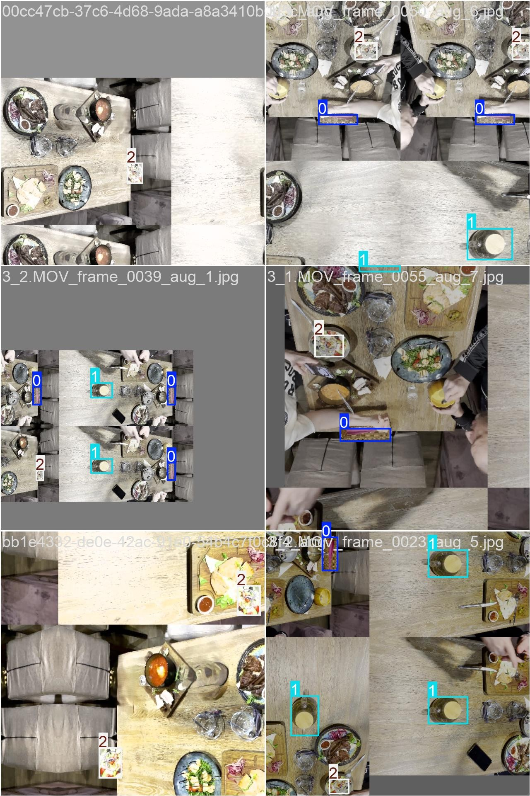
          <figcaption>Batch</figcaption>
      </figure>
</div>


### Графики скорости обучения:

На графиках скорости обучения мы видим разминку в течении 3-х эпох с постепенным увеличением скорости обучения до начально установленной **lr0=0.01**.
На протяжении всего обучения идет постепенное **линейное снижение** скорости.

<div>
   <p style="text-align: left; width: 30%; font-style: italic;">Smoothing 0</p>

   <div style="display: flex; gap: 10px;">
      <figure style="text-align: center; width: 100%;">
          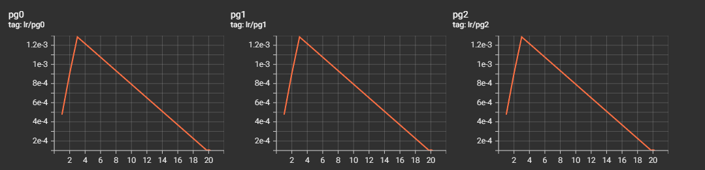
          <figcaption>Lr - Групп параметров</figcaption>
      </figure>
   </div>
</div>

### Графики метрик:

<div>
   <p style="text-align: left; width: 30%; font-style: italic;">Smoothing 0.6</p>

   <div style="display: flex; gap: 10px;">
      <figure style="text-align: center; width: 100%;">
          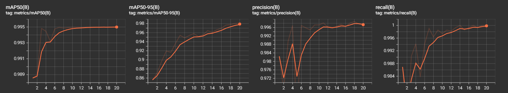
          <figcaption>Metrics: mAP50(B), mAP50-95(B), precision(B), recall(B)</figcaption>
      </figure>
   </div>
</div>

1. **mAP50(B) (средняя точность при IoU=0.5):**

Начальное значение: **0.98857 (1-я эпоха)**.  
Финальное значение: **0.995 (20-я эпоха)**.  
Значение растёт до максимума к 15-20-й эпохам и стабилизируется на уровне **0.99497 - 0.995**, показывая, что модель хорошо классифицирует и локализует объекты.

2. **metrics/mAP50-95(B) (средняя точность для IoU=0.5-0.95):**

Начальное значение: **0.85589 (1-я эпоха)**.  
Финальное значение: **0.98071 (20-я эпоха)**.  
Значение значительно возрастает в первые 5 эпох, после чего улучшения становятся плавными:
 - **1-я эпоха:** 0.85589
 - **10-я эпоха:** 0.95797
 - **20-я эпоха:** 0.98071

Модель постепенно улучшает точность предсказания и локализацию объектов даже при высоких порогах IoU.


3. **Precision(B) (точность):**

Начальное значение: **0.98241 (1-я эпоха)**.  
Финальное значение: **0.99709 (20-я эпоха)**.  
В большинстве эпох значение точности выше **0.99**, что указывает на очень низкий уровень ложных положительных предсказаний.  
Незначительные колебания наблюдаются на 5-й эпохе (падение до **0.95264**), но к 6-й эпохе точность возвращается до уровня **0.99693** и остаётся высокой до конца обучения.


4. **Recall(B) (полнота):**

Начальное значение: **0.98692 (1-я эпоха)**.  
Финальное значение: **1 (20-я эпоха)**.  
Результаты показывают, что модель обнаруживает почти все объекты уже на ранних этапах обучения, а начиная с 13-й эпохи, достигает **идеальной полноты (1.0)**.


### Графики потерь обучения:

<div>
   <p style="text-align: left; width: 30%; font-style: italic;">Smoothing 0</p>

   <div style="display: flex; gap: 10px;">
      <figure style="text-align: center; width: 100%;">
          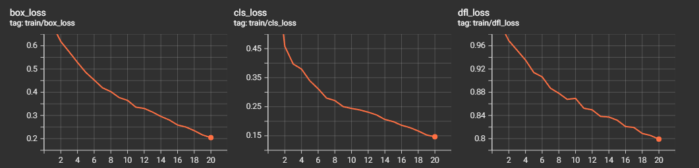
          <figcaption>Train loss: box_loss, cls_loss, dfl_loss</figcaption>
      </figure>
   </div>
</div>

1. **train/box_loss (потери для координат bbox):**

Начальное значение: **0.68857 (1-я эпоха)**  
Финальное значение: **0.20457 (20-я эпоха)**  
Потери значительно уменьшаются в течение первых 10 эпох:
 - **1-я эпоха:** 0.68857
 - **10-я эпоха:** 0.36488

После 10-й эпохи потери уменьшаются плавнее, достигая **0.20457 к 20-й эпохе.**  

2. **train/cls_loss (потери классификации):**

Начальное значение: **0.70681 (1-я эпоха)**  
Финальное значение: **0.1466 (20-я эпоха)**  
Резкое уменьшение потерь с 1-й до 10-й эпохи:  
 - **1-я эпоха:** 0.70681
 - **10-я эпоха:** 0.24417

На поздних этапах обучения (10-20 эпохи) потери продолжают плавно уменьшаться, достигая минимального значения **0.1466.**

3. **train/dfl_loss (потери распределения границ):**

Начальное значение: **0.9965 (1-я эпоха)**  
Финальное значение: **0.7992 (20-я эпоха)**  
В отличие от других метрик, `train/dfl_loss` снижается медленнее:  
 - **1-я эпоха:** 0.9965
 - **10-я эпоха:** 0.86937
 - **20-я эпоха:** 0.7992


### Графики валидационных потерь:

<div>
   <p style="text-align: left; width: 30%; font-style: italic;">Smoothing 0</p>

   <div style="display: flex; gap: 10px;">
      <figure style="text-align: center; width: 100%;">
          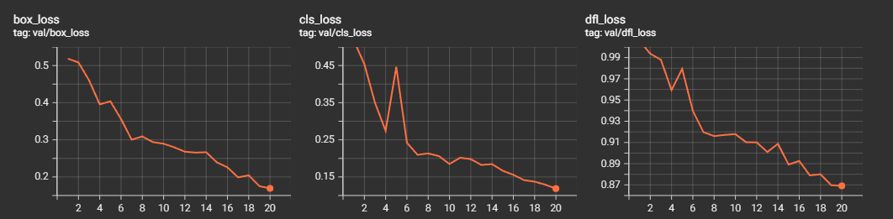
          <figcaption>Valid loss: box_loss, cls_loss, dfl_loss</figcaption>
      </figure>
   </div>
</div>

1. **val/box_loss (потери для координат bbox):**

Начальное значение: **0.51863 (1-я эпоха)**.  
Финальное значение: **0.16924 (20-я эпоха)**.

Резкое падение в первые 10 эпох:  
 - **1-я эпоха:** 0.51863  
 - **10-я эпоха:** 0.28946  

На поздних этапах (10-20 эпохи) снижение замедляется: **0.28946 - 0.16924**.

2. **val/cls_loss (потери классификации):**

Начальное значение: **0.51776 (1-я эпоха)**.  
Финальное значение: **0.11863 (20-я эпоха)**.  
На ранних этапах (1-10 эпохи) потери падают значительно: **0.51776 - 0.18489**.  
На поздних этапах обучения (11-20 эпохи) потери уменьшаются медленнее, достигая **0.11863**.  


3. **val/dfl_loss (потери распределения границ):**

Начальное значение: **1.00579 (1-я эпоха)**.  
Финальное значение: **0.8691 (20-я эпоха)**.  
Потери снижаются значительно медленнее по сравнению с `val/box_loss` и `val/cls_loss`:  
 - **1-я эпоха:** 1.00579  
 - **10-я эпоха:** 0.91786 
 - **20-я эпоха:** 0.8691 


### F1-score:

<div style="display: flex; gap: 10px;">
      <figure style="text-align: center; width: 50%;">
          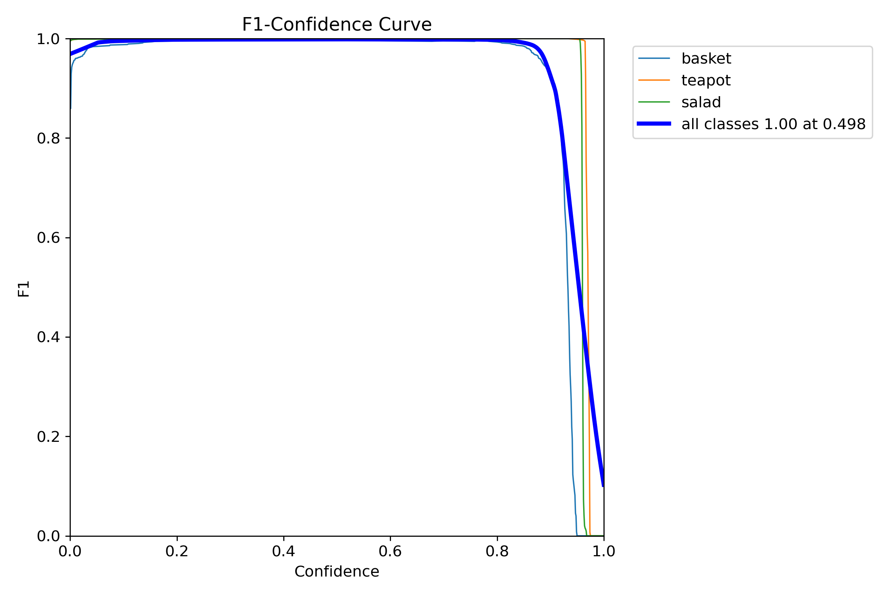
          <figcaption>F1-score</figcaption>
      </figure>
</div>


На графике изображена F1-кривая в зависимости от порога уверенности (Confidence). 
Также приведена агрегированная кривая для всех классов.

F1-метрика близка к 1.0 на всём интервале уверенности **[0.0, ~0.9]**, что говорит о высокой точности и полноте модели при различных порогах.
Резкий спад F1 происходит на участке от 0.9 до 1.0, особенно заметный для basket класса.

Оптимальное значение порога для всех классов **0.498**. F1 достигается 1.00, это отражено толстой синей линией.


### Матрица ошибок (Confusion Matrix):

<div>

   <div style="display: flex; gap: 10px;">
      <figure style="text-align: center; width: 50%;">
          
          <figcaption>Confusion Matrix</figcaption>
      </figure>
   </div>
</div>


 - basket: 455 правильно, 3 ошибочно классифицировано как background.
 - teapot: 455 правильно, ошибок нет.
 - salad: 470 правильно, ошибок нет.
 - background: нет ложных срабатываний (хороший показатель)

Модель почти безошибочно классифицирует объекты всех классов. За исключением - 3 объекта basket, которые были неправильно предсказаны.  
Уровень ошибок менее 0.3% (3 из 1383), что подтверждает хорошие результаты на F1-кривой.

---

## 2.2 Train 2.

Использовались такие же параметры, как и в первом обучении, за исключением - был активирован cos_lr: 
    
 - cos_lr=True - включен косинусный планировщик скорости обучения, регуляция скорости обучения по косинусной кривой в течение эпох.
 - epochs=20 - для сравнения так же 20 проходов.
 - imgsz=640 - (по умолчанию)
 - batch=6 - загрузка GPU примерно 80-90%
 - patience=5 - (по умолчанию 10) установлен 5 т.к. не большое количество эпох.
 - optimizer=AdamW - (был выбран автоматически фреймворком Ultralytics, на основе конфигурации модели)

Остальные параметры были установлены по умолчанию фреймворком ([Параметры обучения train_yolo11x2](ZEBRA/train_yolo11x2/args.yaml))

#### Пример тренировочной партии: 

<div style="display: flex; gap: 10px;">
      <figure style="text-align: center; width: 50%;">
          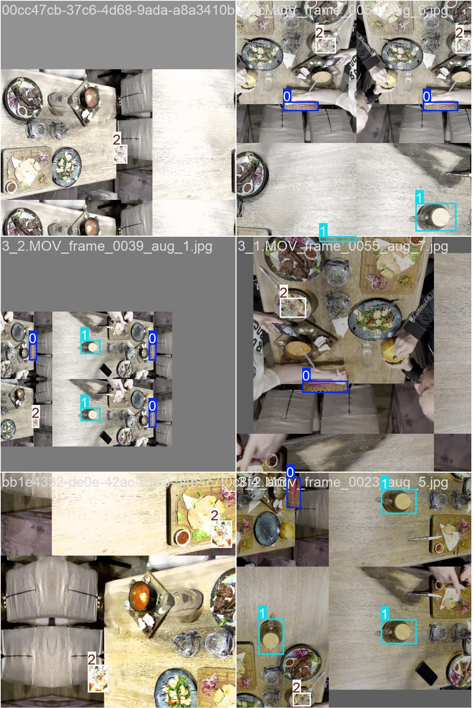
          <figcaption>Batch</figcaption>
      </figure>
</div>


### Графики скорости обучения:

Аналогично видим разминку в течении 3-х эпох (чтобы предотвратить резкие изменения параметров модели и стабилизировать начальные веса).
Косинусная стратегия уменьшения скорости обучения (cos_lr=True) управляет параметром LR, начиная с заданного начального значения (lr0=0.01)
и постепенно снижая его до заданного конечного уровня (lrf=0.01), но **с использованием косинусной функции**.
Такой планировщик создает эффект постепенного замедления уменьшения скорости на последних этапах, обеспечивая более плавное обучение ближе к концу. 
Это уменьшает вероятность переобучения и позволяет модели тонко доработать параметры.


<div>
   <p style="text-align: left; width: 30%; font-style: italic;">Smoothing 0</p>

   <div style="display: flex; gap: 10px;">
      <figure style="text-align: center; width: 100%;">
          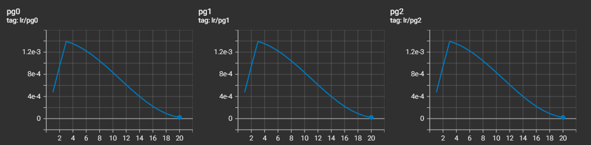
          <figcaption>Lr - Групп параметров</figcaption>
      </figure>
   </div>
</div>

### Графики метрик:

<div>
   <p style="text-align: left; width: 30%; font-style: italic;">Smoothing 0</p>

   <div style="display: flex; gap: 10px;">
      <figure style="text-align: center; width: 100%;">
          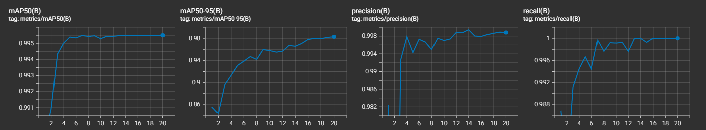
          <figcaption>Metrics: mAP50(B), mAP50-95(B), precision(B), recall(B)</figcaption>
      </figure>
   </div>
</div>

1. **mAP50(B) (средняя точность при IoU=0.5):**

Начальное значение: **0.98857 (1-я эпоха)**.  
Плавно увеличивается на протяжении первых нескольких эпох до значения **0.995 (начиная с 13-й эпохи)**, где стабилизируется.  

2. **metrics/mAP50-95(B) (средняя точность для IoU=0.5-0.95):**

Начальное значение: **0.85589 (1-я эпоха)**.  
Быстро растет на начальных этапах (особенно с 1-й до 6-й эпохи), затем переходит на стабильный рост после 10-й эпохи.  
Максимальное значение достигается на **20-й эпохе: 0.98287**, что подтверждает способность модели точно работать по локализации объектов.  

3. **Precision(B) (точность):**

Начальное значение: **0.98241 (1-я эпоха)**.  
Метрика остается consistently высокой (> 0.89) на всем протяжении обучения, достигая **максимума в 0.99891 (19-я эпоха)**.  
В большинстве эпох точность превышает значение **0.99**, что свидетельствует о минимальном количестве ложноположительных предсказаний.  


4. **Recall(B) (полнота):**

Начальное значение: **0.98692 (1-я эпоха)**.  
В большинстве эпох обеспечивается хорошая полнота (1.0), начиная с 13-й эпохи, что подтверждает на 100% обнаружение всех объектов (минимальное количество ложноотрицательных объектов).  


### Графики потерь обучения:

<div>
   <p style="text-align: left; width: 30%; font-style: italic;">Smoothing 0</p>

   <div style="display: flex; gap: 10px;">
      <figure style="text-align: center; width: 100%;">
          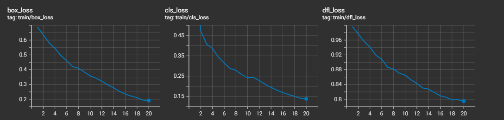
          <figcaption>Train loss: box_loss, cls_loss, dfl_loss</figcaption>
      </figure>
   </div>
</div>

1. **train/box_loss (потери для координат bbox):**

Начальное значение: **0.68857 (1-я эпоха)**.  
Финальное значение: **0.19164 (20-я эпоха)**.  
Наблюдается последовательное уменьшение потерь локализации с резким спадом на первых 10 эпохах (От **0.68857** до **0.35813 (10-я эпоха)**).  
После 10-й эпохи снижение становится более плавным, достигая **0.19164 к 20-й эпохе**.  

2. **train/cls_loss (потери классификации):**

Начальное значение: **0.70681 (1-я эпоха)**.  
Финальное значение: **0.13846 (20-я эпоха)**.  
Как и с локализацией, наблюдается резкое снижение на первых 10 эпохах.  
Потери уменьшаются с **0.70681** до **0.24147 (10-я эпоха)**.  
На финальных этапах обучения (11-20 эпохи) потери стабилизируются на уровне **0.13846**, отражая минимальные ошибки в классификации.  


3. **train/dfl_loss (потери распределения границ):**

Начальное значение: **0.9965 (1-я эпоха)**.  
Финальное значение: **0.79495 (20-я эпоха)**.  
В отличие от `train/box_loss` и `train/cls_loss`, спад `train/dfl_loss` происходит медленнее.  
Снижение менее выражено: от **0.9965** до **0.86513 (10-я эпоха)**.  
Даже на 20-й эпохе потери по распределению остаются самыми большими среди всех типов потерь (**0.79495**).  
Стабильное снижение подтверждает, что модель корректно подстраивает предсказания границ объектов.  


### Графики валидационных потерь:

<div>
   <p style="text-align: left; width: 30%; font-style: italic;">Smoothing 0</p>

   <div style="display: flex; gap: 10px;">
      <figure style="text-align: center; width: 100%;">
          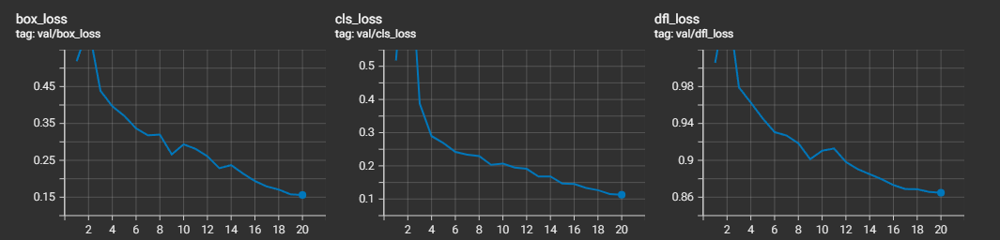
          <figcaption>Valid loss: box_loss, cls_loss, dfl_loss</figcaption>
      </figure>
   </div>
</div>

1. **val/box_loss (потери для координат bbox):**

Начальное значение: **0.51863 (1-я эпоха)**.  
Финальное значение: **0.15605 (20-я эпоха)**.  
На протяжении обучения наблюдается стабильное снижение потерь.  
Резкое уменьшение происходит между 1-й и 10-й эпохами: **0.51863 - 0.26605**.  
На последних эпохах темп изменения значительно замедляется, теряя лишь небольшую часть: **0.17897 - 0.15605 (17-20 эпохи)**.  

2. **val/cls_loss (потери классификации):**

Начальное значение: **0.51776 (1-я эпоха)**.  
Финальное значение: **0.11293 (20-я эпоха)**.  
Пиковое увеличение наблюдается на **2-й эпохе (0.95705)**, но потери быстро снижаются уже к 3-й эпохе (**0.38726**), а затем продолжают плавное падение.  
За первые 10 эпох: **0.51776 - 0.2069**, что демонстрирует улучшение качества классификации.  
Финальные эпохи: **0.17897 - 0.11293**, достигается минимальный уровень потерь.  

3. **val/dfl_loss (потери распределения границ):**

Начальное значение: **1.00579 (1-я эпоха)**.  
Финальное значение: **0.86483 (20-я эпоха)**.  
Потери распределения границ уменьшаются в медленном темпе:  
В промежутке с 1-й до 10-й эпох снижения составляют: **1.00579 - 0.90126**.  
С 10-й до 20-й эпохи значения снижаются умеренно: **0.90126 - 0.86483**, наблюдается стабилизация.  


### F1-score:

<div style="display: flex; gap: 10px;">
      <figure style="text-align: center; width: 50%;">
          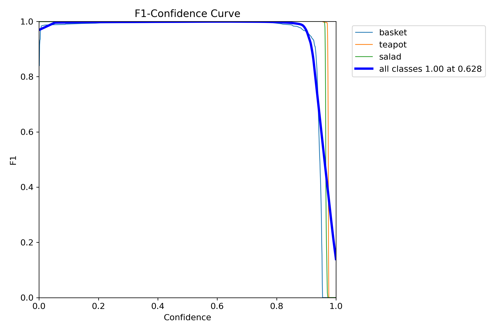
          <figcaption>F1-score</figcaption>
      </figure>
</div>


На графике изображена F1-кривая в зависимости от порога уверенности (Confidence).  
Также приведена агрегированная кривая для всех классов.  
F1-метрика близка к 1.0 на всём интервале уверенности **[0.0, ~0.9]**, что говорит о высокой точности и полноте модели при различных порогах.  
Резкий спад F1 происходит на участке от 0.9 до 1.0, особенно заметный для basket класса.  
Оптимальное значение порога для всех классов **0.628**. F1 достигается 1.00, это отражено толстой синей линией.  


### Матрица ошибок (Confusion Matrix):

<div>

   <div style="display: flex; gap: 10px;">
      <figure style="text-align: center; width: 50%;">
          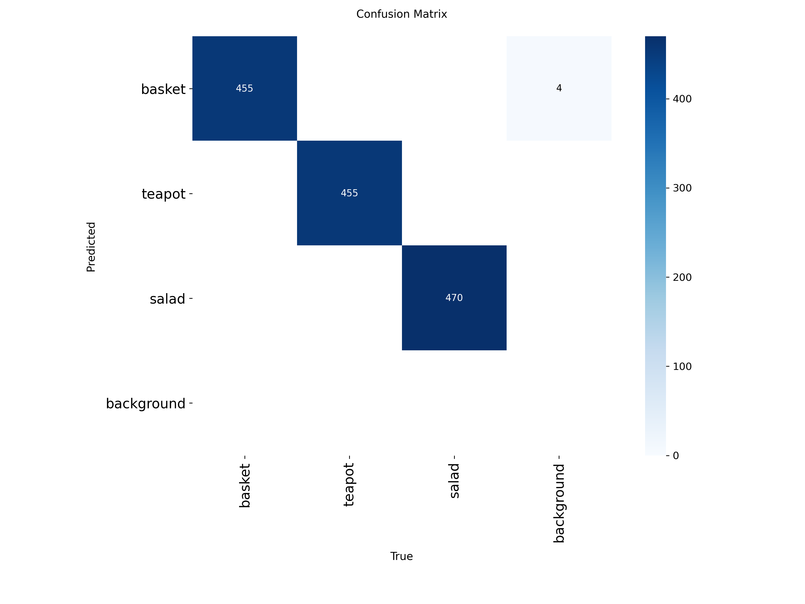
          <figcaption>Confusion Matrix</figcaption>
      </figure>
   </div>
</div>


 - basket: 455 правильно, 4 ошибочно классифицировано как background.
 - teapot: 455 правильно, ошибок нет.
 - salad: 470 правильно, ошибок нет.
 - background: нет ложных срабатываний (хороший показатель)

Модель почти безошибочно классифицирует объекты всех классов. За исключением - 4 объекта basket, которые были неправильно предсказаны.  
Уровень ошибок менее 0.3% (4 из 1383), что подтверждает хорошие результаты на F1-кривой.  

---

## 2.3 Train 3.

Использовались такие же параметры, как и во втором обучение с увеличением числа проходов (до 40), отключение добавления мозаик на последних 5 этапах: 
 - close_mosaic=5 (по умолчанию 10) Замена в связи с наблюдением повторных уменьшений потерь при val и train на ~10 эпохе предыдущих тренировках (Train1, Train2). 
 - cos_lr=True - включен косинусный планировщик скорости обучения, регуляция скорости обучения по косинусной кривой в течение эпох.
 - epochs=40 - увеличено для сравнения результатов.
 - imgsz=640 - (по умолчанию)
 - batch=6 - загрузка GPU примерно 80-90%
 - patience=5 - (по умолчанию 10) установил 5 т.к. не большое количество эпох.
 - optimizer=AdamW - (был выбран автоматически фреймворком Ultralytics, на основе конфигурации модели)

Остальные параметры были установлены по умолчанию фреймворком ([Параметры обучения train_yolo11x3](ZEBRA/train_yolo11x3/args.yaml)

#### Пример тренировочной партии: 

<div style="display: flex; gap: 10px;">
      <figure style="text-align: center; width: 50%;">
          
          <figcaption>Batch</figcaption>
      </figure>
</div>


### Графики скорости обучения:

Аналогично предыдущим обучениям видим разминку в течении 3-х эпох (чтобы предотвратить резкие изменения параметров модели и стабилизировать начальные веса).
Косинусная стратегия уменьшения скорости обучения (cos_lr=True) управляет параметром LR, начиная с заданного начального значения (lr0=0.01)
и постепенно снижая его до заданного конечного уровня (lrf=0.01), но **с использованием косинусной функции**.
Такой планировщик создает эффект постепенного замедления уменьшения скорости на последних этапах, обеспечивая более плавное обучение ближе к концу. 
Это уменьшает вероятность переобучения и позволяет модели тонко доработать параметры.


<div>
   <p style="text-align: left; width: 30%; font-style: italic;">Smoothing 0</p>

   <div style="display: flex; gap: 10px;">
      <figure style="text-align: center; width: 100%;">
          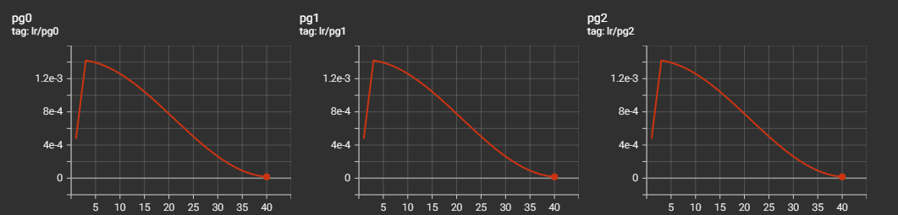
          <figcaption>Lr - Групп параметров</figcaption>
      </figure>
   </div>
</div>

### Графики метрик:

<div>
   <p style="text-align: left; width: 30%; font-style: italic;">Smoothing 0</p>

   <div style="display: flex; gap: 10px;">
      <figure style="text-align: center; width: 100%;">
          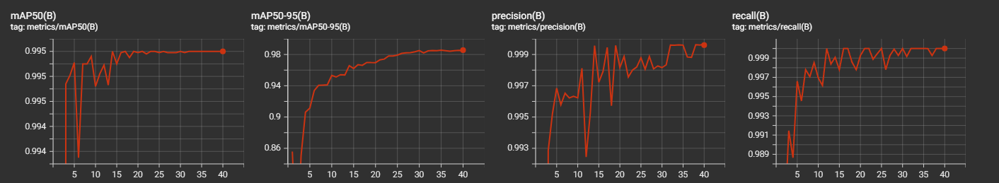
          <figcaption>Metrics: mAP50(B), mAP50-95(B), precision(B), recall(B)</figcaption>
      </figure>
   </div>
</div>

1. **mAP50(B) (средняя точность при IoU=0.5):**

Начальное значение: **0.98857 (1-я эпоха)**.  
Финальное значение: **0.995 (40-я эпоха)**.  
Падение на 2-й эпохе (**0.89452**) коррелирует с изменениями Recall и Precision.  
Уже на 3-й эпохе стабилизируется на значениях **0.994**.  
С 20-й эпохи остаётся ровным на максимальном уровне - **0.995**.  

2. **metrics/mAP50-95(B) (средняя точность для IoU=0.5-0.95):**

Начальное значение: **0.85589 (1-я эпоха)**.  
Финальное значение: **0.98563 (40-я эпоха)**.  
Значительное снижение на 2-й эпохе (**0.72406**) - связано скорей всего с ранним этапом обучения.  
Восстановление к 5-й эпохе (**0.91153**), после чего - **стабильный рост**.  
На 20-40 эпохах показания метрики находятся в диапазоне **0.97-0.985**, что является отличным результатом.  
 

3. **Precision(B) (точность):**

Начальное значение: **0.98241 (1-я эпоха)**.  
Финальное значение: **0.99965 (40-я эпоха)**.  
Падение наблюдается на 2-й эпохе (**0.76281**).  
С 3-й эпохи точность резко возрастает (**0.99286 - 0.995**) и стабилизируется начиная с 10-й эпохи (**0.996**).  
Начиная с 30-й эпохи, Precision практически равен **1.0**.  


4. **Recall(B) (полнота):**

Начальное значение: **0.98692 (1-я эпоха)**.  
Финальное значение: **1.0 (достигается на нескольких эпохах)**.  
Снижение на 2-й эпохе (**0.98202**) - соответствует общему изменению другой метрики Precision.
С 3-й эпохи Recall возрастает и стабилизируется на значениях выше **0.998**.
Полнота достигает **1.0** на этапе 12 и несколько позже, что говорит об отсутствии пропусков объектов.


### Графики потерь обучения:

<div>
   <p style="text-align: left; width: 30%; font-style: italic;">Smoothing 0</p>

   <div style="display: flex; gap: 10px;">
      <figure style="text-align: center; width: 100%;">
          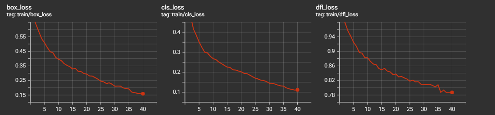
          <figcaption>Train loss: box_loss, cls_loss, dfl_loss</figcaption>
      </figure>
   </div>
</div>

1. **train/box_loss (потери для координат bbox):**

Начальное значение: **0.68857**.  
Финальное значение: **0.15915**.  
Значительное снижение на ранних этапах (1-10 эпохи) **0.68857 - 0.39554**.  
Более плавное улучшение на более поздних этапах (11-40 эпохи) **0.39554 - 0.15915**.  

2. **train/cls_loss (потери классификации):**

Начальное значение: **0.70681**.   
Финальное значение: **0.11198** (40-я эпоха).  
Резкое уменьшение ошибок в первые 10 эпох (**0.70681 - 0.26792**).  
Это говорит о том, что модель начинает различать классы объектов уже на раннем этапе.  
Постепенное улучшение со стабилизацией, метрика достигает **0.11198** на последних этапах.


3. **train/dfl_loss (потери распределения границ):**

Начальное значение: **0.9965**.  
Финальное значение: **0.78719**.  
Снижение менее стремительное, чем у других потерь.  
Значительное уменьшение за первые 10 эпох (**0.9965 - 0.8825**), а затем стабильное снижение.  
Небольшие колебания в конце обучения (**0.78712 - 0.78719**).  


### Графики валидационных потерь:

<div>
   <p style="text-align: left; width: 30%; font-style: italic;">Smoothing 0</p>

   <div style="display: flex; gap: 10px;">
      <figure style="text-align: center; width: 100%;">
          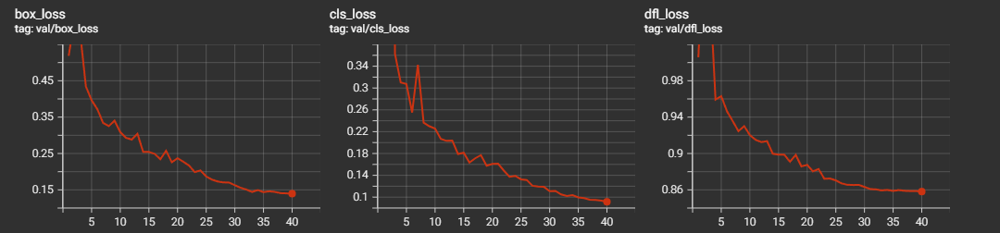
          <figcaption>Valid loss: box_loss, cls_loss, dfl_loss</figcaption>
      </figure>
   </div>
</div>

1. **val/box_loss (потери для координат bbox):**

Начальное значение: **0.51863 (1-я эпоха)**.  
Повышение: **0.61638 (2-я эпоха)**, может быть связано с адаптацией модели к сложности данных на раннем этапе.  
Финальное значение: **0.13957 (40-я эпоха)**.  
Ранний спад потерь - уже к 10-й эпохе они снижаются до **0.30876**, после чего процесс замедляется.  
После 20-й эпохи спад становится минимальным, значения стабилизируются на уровне **0.14 - 0.15**.  

2. **val/cls_loss (потери классификации):**

Начальное значение: **0.51776 (1-я эпоха)**.  
Повышение: **2.63552 (2-я эпоха)** - увеличение ошибок на раннем этапе обучения.  
Финальное значение: **0.0915 (40-я эпоха)**.  
После увеличения на 2-й эпохе потери начинают стремительно снижаться.  
Уже на 10-й эпохе достигают **0.22561**, затем стабилизируется.  
Начиная с 30-й эпохи, значения падают ниже **0.1**, что указывает на очень высокую точность классификации.  
  

3. **val/dfl_loss (потери распределения границ):**

Начальное значение: **1.00579 (1-я эпоха)**.  
Финальное значение: **0.85811 (40-я эпоха)**.
Снижение происходит медленнее, чем у других типов потерь.  
К 10-й эпохе наблюдается значение **0.92021**, что демонстрирует постепенное улучшение в предсказании распределения границ.  
С 30-й эпохи значения стабилизируются в пределах **0.85 - 0.86**. 
 


### F1-score:

<div style="display: flex; gap: 10px;">
      <figure style="text-align: center; width: 50%;">
          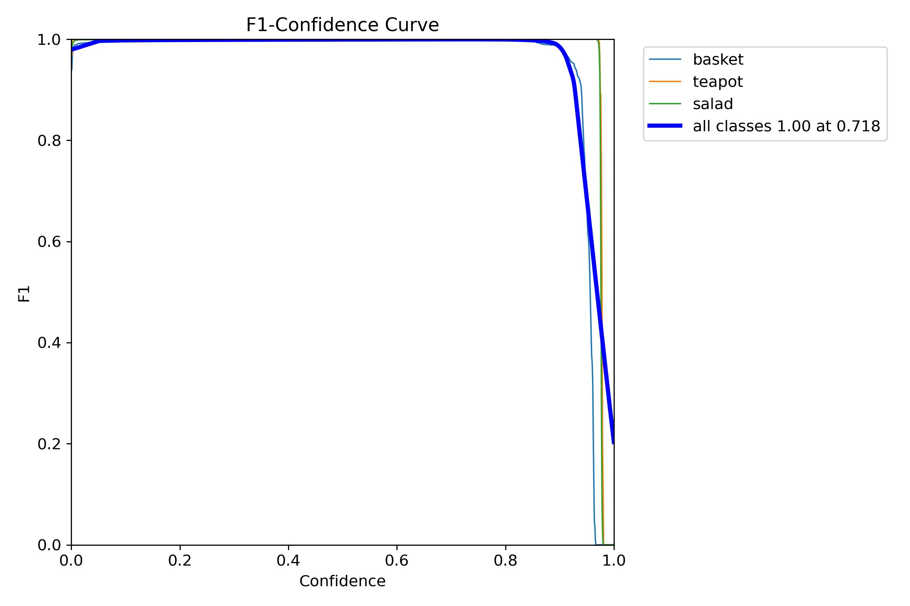
          <figcaption>F1-score</figcaption>
      </figure>
</div>


На графике изображена F1-кривая в зависимости от порога уверенности (Confidence).  
Также приведена агрегированная кривая для всех классов.  
F1-метрика близка к 1.0 на всём интервале уверенности **[0.0, ~0.9]**, что говорит о высокой точности и полноте модели при различных порогах.  
Резкий спад F1 происходит на участке от 0.9 до 1.0, особенно заметный для basket класса.  
Оптимальное значение порога для всех классов **0.718**. F1 достигается 1.00, это отражено толстой синей линией.  


### Матрица ошибок (Confusion Matrix):

<div>

   <div style="display: flex; gap: 10px;">
      <figure style="text-align: center; width: 50%;">
          
          <figcaption>Confusion Matrix</figcaption>
      </figure>
   </div>
</div>


 - basket: 455 правильно, 2 ошибочно классифицировано как background.
 - teapot: 455 правильно, ошибок нет.
 - salad: 470 правильно, ошибок нет.
 - background: нет ложных срабатываний (хороший показатель)

Модель почти безошибочно классифицирует объекты всех классов. За исключением - 2 объекта basket, которые были неправильно предсказаны.  
Уровень ошибок менее 0.2% (2 из 1383), что подтверждает хорошие результаты на F1-кривой.  

---

## 2.4 Train 4.

Использовались такие же параметры, как и в третьем обучение, был изменен выбор optimizer='SGD': 
 - optimizer='SGD' выбрана более простая стратегия обновления параметров в отличие от адаптивного оптимизатора `AdamW`
 - close_mosaic=5 (по умолчанию 10). 
 - cos_lr=True - включен косинусный планировщик скорости обучения, регуляция скорости обучения по косинусной кривой в течение эпох.
 - epochs=40 - для сравнения с 3-й тренировкой оставлено 40 проходов.
 - imgsz=640 - (по умолчанию)
 - batch=6 - загрузка GPU примерно 80-90%
 - patience=5 - (по умолчанию 10) установил 5 т.к. не большое количество эпох.


Остальные параметры были установлены по умолчанию фреймворком ([Параметры обучения train_yolo11x4](ZEBRA/train_yolo11x4/args.yaml)

#### Пример тренировочной партии: 

<div style="display: flex; gap: 10px;">
      <figure style="text-align: center; width: 50%;">
          
          <figcaption>Batch</figcaption>
      </figure>
</div>


### Графики скорости обучения:

Аналогично предыдущим обучениям видим разминку в течении 3-х эпох (чтобы предотвратить резкие изменения параметров модели и стабилизировать начальные веса).
Косинусная стратегия уменьшения скорости обучения (cos_lr=True) управляет параметром LR, начиная с заданного начального значения (lr0=0.01)
и постепенно снижая его до заданного конечного уровня (lrf=0.01), но **с использованием косинусной функции**.
Такой планировщик создает эффект постепенного замедления уменьшения скорости на последних этапах, обеспечивая более плавное обучение ближе к концу. 
Это уменьшает вероятность переобучения и позволяет модели тонко доработать параметры.

На первом этапе для **pg0** выбрано значение, гораздо большее, чем для других групп параметров.  
С 4-й эпохи и далее соблюдается одинаковое значение LR на всех группах (примерно синхронизация после последней 3-й эпохи разминки).


<div>
   <p style="text-align: left; width: 30%; font-style: italic;">Smoothing 0</p>

   <div style="display: flex; gap: 10px;">
      <figure style="text-align: center; width: 100%;">
          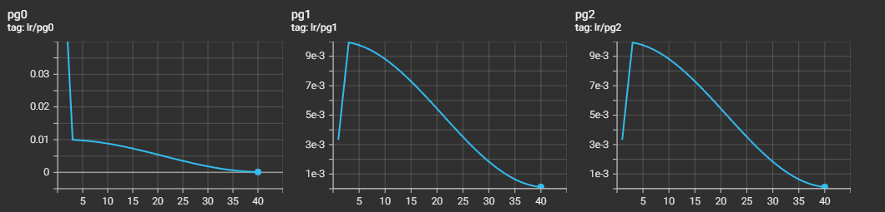
          <figcaption>Lr - Групп параметров</figcaption>
      </figure>
   </div>
</div>

### Графики метрик:

<div>
   <p style="text-align: left; width: 30%; font-style: italic;">Smoothing 0</p>

   <div style="display: flex; gap: 10px;">
      <figure style="text-align: center; width: 100%;">
          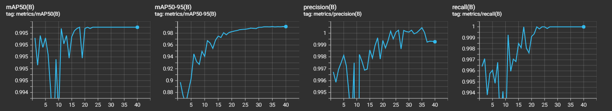
          <figcaption>Metrics: mAP50(B), mAP50-95(B), precision(B), recall(B)</figcaption>
      </figure>
   </div>
</div>

1. **mAP50(B) (средняя точность при IoU=0.5):**

Начальное значение: **0.99491** (1-я эпоха).  
Финальное значение: **0.995** (на всех последних эпохах).  
Показатель практически не меняется и остаётся стабильным на уровне **0.995**.  


2. **metrics/mAP50-95(B) (средняя точность для IoU=0.5-0.95):**

Начальное значение: **0.89741** (1-я эпоха).  
Финальное значение: **0.99122** (40-я эпоха).  
Значительный прирост метрики в первые 20 эпох (**0.89741** - **0.98084**).  
После 20-й эпохи метрика растёт медленнее, стабилизируясь на уровне **0.990 - 0.991**  

 

3. **Precision(B) (точность):**

Начальное значение: **0.99623** (1-я эпоха).  
Финальное значение: **0.99878 - 0.99996** (37-40 эпохи).  
На всех этапах метрика остаётся на высоком уровне (ближе к 1.0).  
Наибольшее падение наблюдается на 10-й эпохе (**0.95774**).  
После 10-й эпохи точность восстанавливается и остаётся стабильно **0.998**.  


4. **Recall(B) (полнота):**

Начальное значение: **0.9964** (1-я эпоха).  
Финальное значение: **1.0** (достигается на нескольких эпохах, начиная с 17-й).  
Показатель повышается и достигает **1.0** уже на 17-й эпохе.  
Небольшие колебания происходят до стабилизации (см. эпохи 7-10: **0.99095 - 0.99414**).  


### Графики потерь обучения:

<div>
   <p style="text-align: left; width: 30%; font-style: italic;">Smoothing 0</p>

   <div style="display: flex; gap: 10px;">
      <figure style="text-align: center; width: 100%;">
          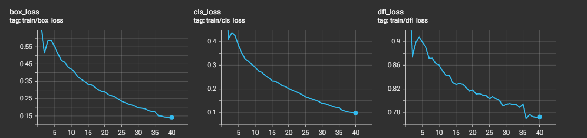
          <figcaption>Train loss: box_loss, cls_loss, dfl_loss</figcaption>
      </figure>
   </div>
</div>

1. **train/box_loss (потери для координат bbox):**

Начальное значение: **0.65958** (1-я эпоха).  
Финальное значение: **0.14097** (40-я эпоха).  
На первой десятке эпох потери значительно сокращаются (**0.65958 - 0.42246**).  
После 20-й эпохи темп снижения замедляется, стабилизируясь на уровне ниже **0.2** в последние 10 эпох.  
  

2. **train/cls_loss (потери классификации):**

Начальное значение: **0.83252** (1-я эпоха).  
Финальное значение: **0.09901** (40-я эпоха).  
После значительного снижения на ранних этапах (**0.83252 - 0.29212** к 10-й эпохе) метрика продолжает плавно снижаться.  
На последних этапах потери опускаются ниже **0.1**, что подтверждает способность модели минимизировать ошибки классификации.


3. **train/dfl_loss (потери распределения границ):**

Начальное значение: **0.98472** (1-я эпоха).  
Финальное значение: **0.77306** (40-я эпоха).  
Снижение происходит медленнее, чем у других метрик (**0.98472 - 0.86014** к 10-й эпохе).  
К 40-й эпохе потери всё ещё медленно снижаются.  


### Графики валидационных потерь:

<div>
   <p style="text-align: left; width: 30%; font-style: italic;">Smoothing 0.6</p>

   <div style="display: flex; gap: 10px;">
      <figure style="text-align: center; width: 100%;">
          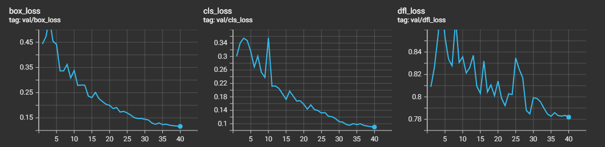
          <figcaption>Valid loss: box_loss, cls_loss, dfl_loss</figcaption>
      </figure>
   </div>
</div>

1. **val/box_loss (потери для координат bbox):**

Начальное значение: **0.44271** (1-я эпоха).  
Финальное значение: **0.11628** (40-я эпоха).  
Первоначально потери немного растут до 3-й эпохи (**0.54353**), из-за адаптации модели на ранних этапах.  
После 4-й эпохи потери стабильно уменьшаются.  
Начиная с 20-й эпохи, значения опускаются ниже **0.2** и достигают стабилизации ближе к **0.11**.  

2. **val/cls_loss (потери классификации):**

Начальное значение: **0.30072** (1-я эпоха).  
Финальное значение: **0.09029** (40-я эпоха).  
На начальных эпохах (до 3-й) небольшое увеличение потерь.  
После 5-й эпохи значения начинают стабильно снижаться.  
На поздних этапах (после 30-й эпохи) потери в пределах **0.09**.


3. **val/dfl_loss (потери распределения границ):**

Начальное значение: **0.80892** (1-я эпоха).  
Финальное значение: **0.78189** (40-я эпоха).  
На ранних этапах метрика увеличивается до **0.88668** (4-я эпоха).  
После 5-й эпохи начинается плавное снижение потерь.  
Темп уменьшения медленный, а финальные значения стабилизируются в пределах **0.781 - 0.782**.

 


### F1-score:

<div style="display: flex; gap: 10px;">
      <figure style="text-align: center; width: 50%;">
          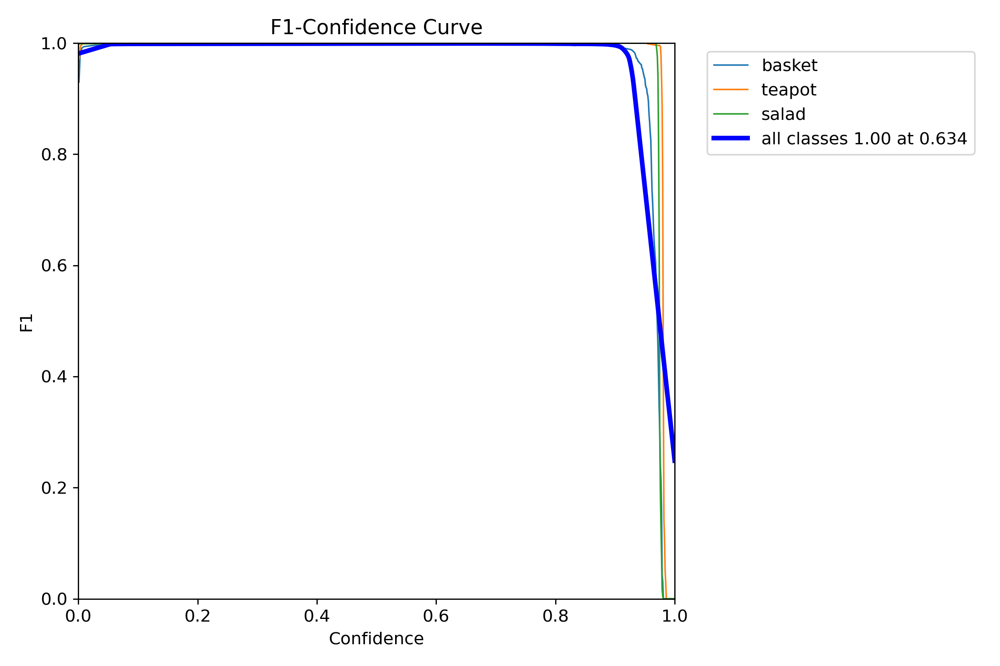
          <figcaption>F1-score</figcaption>
      </figure>
</div>


На графике изображена F1-кривая в зависимости от порога уверенности (Confidence).  
Также приведена агрегированная кривая для всех классов.  
F1-метрика близка к 1.0 на всём интервале уверенности **[0.0, ~0.9]**, что говорит о высокой точности и полноте модели при различных порогах.  
Резкий спад F1 происходит на участке от 0.9 до 1.0, особенно заметный для basket класса.  
Оптимальное значение порога для всех классов **0.634**. F1 достигается 1.00, это отражено толстой синей линией.  


### Матрица ошибок (Confusion Matrix):

<div>

   <div style="display: flex; gap: 10px;">
      <figure style="text-align: center; width: 50%;">
          
          <figcaption>Confusion Matrix</figcaption>
      </figure>
   </div>
</div>


 - basket: 455 правильно, 1 ошибочно классифицировано как background.
 - teapot: 455 правильно, ошибок нет.
 - salad: 470 правильно, ошибок нет.
 - background: нет ложных срабатываний (хороший показатель)

Модель почти безошибочно классифицирует объекты всех классов. За исключением - 1 объекта basket, которые были неправильно предсказаны.  
Уровень ошибок менее 0.1% (1 из 1383), что подтверждает хорошие результаты на F1-кривой.  

---

## 2.5 Сравнение эффективности между тренировками

Сравнение ключевых параметров, по которым можно сравнить эффективность тренировок, и анализ различия между ними:


### **1. Средняя точность (mAP50 и mAP50-95):**

<div>
   <p style="text-align: left; width: 30%; font-style: italic;">Smoothing 0</p>

   <div style="display: flex; gap: 10px;">
      <figure style="text-align: center; width: 100%;">
          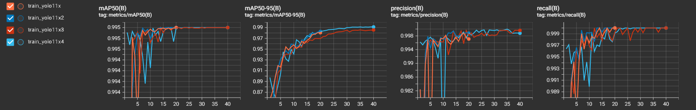
          <figcaption>Train Metrics</figcaption>
      </figure>
   </div>
</div>

- **Train 1**:  
  - `mAP50`: начальное значение **0.98857**, финальное **0.995**.  
  - `mAP50-95`: начальное значение **0.85589**, финальное **0.98071**.  

- **Train 2** (с `cos_lr`):
  - `mAP50`: начальное значение **0.98857**, финальное **0.995**.  
  - `mAP50-95`: начальное значение **0.85589**, финальное **0.98287**.  
  - **Плюс**: плавное изменение скорости обучения с использованием косинусного планировщика улучшило `mAP50-95` (на ~0.2%, что важно при высоких порогах IoU).  

- **Train 3** (с увеличением эпох до 40 и `close_mosaic=5`):
  - `mAP50`: начальное значение **0.98857**, финальное **0.995** (аналогично Train 1 и 2).  
  - `mAP50-95`: начальное значение **0.85589**, финальное **0.98563**.  
  - **Плюс**: увеличение числа эпох и изменение стратегии mosaic позволили добиться более плавного роста `mAP50-95` (лучше, чем Train 2).  

- **Train 4** (с оптимизатором `SGD`):  
  - `mAP50`: начальное значение **0.99491**, финальное **0.995**.  
  - `mAP50-95`: начальное значение **0.89741**, финальное **0.99122**.  
  - **Плюс**: использование оптимизатора `SGD`, улучшило производительность по сравнению с предыдущими тренировками, особенно при высоких порогах IoU (`mAP50-95` выше всех).  

#### **Резюме по mAP50-95:**  
- Train 4 показывает **лучший результат из всех** (`0.99122`), особенно из-за использования оптимизатора `SGD`.
- Train 3 также даёт улучшения (`mAP50-95=0.98563`) за счет увеличения числа эпох и гибкого использования мозаик.  

---

#### **2. Precision (точность):**
- **Train 1**: точность увеличилась с **0.98241** до **0.99709**.
- **Train 2**: точность увеличилась с **0.98241** до **0.99891** (выше, чем в Train 1).  
- **Train 3**: точность увеличилась с **0.98241** до **0.99965** (стабилизируется ближе к идеалу).  
- **Train 4**: точность выросла с **0.99623** до **0.99996**.  

#### **Резюме по Precision:**  
- Train 4 показывает **лучший результат** по точности (`0.99996`), что свидетельствует о минимальном числе ложноположительных классификаций.
- Train 3 также близок к этому результату (`0.99965`).  

---

#### **3. Recall (полнота):**
- **Train 1**: Полнота улучшилась с **0.98692** до **1.0** к 13-й эпохе.  
- **Train 2**: Полнота улучшилась с **0.98692** до **1.0** к 13-й эпохе (аналогично Train 1).  
- **Train 3**: Полнота была выше **0.998** после первых 3 эпох и достигла **1.0**.  
- **Train 4**: Полнота (`Recall`) улучшилась с **0.9964** до **1.0**, начиная с 17-й эпохи (стабильнее в поздних эпохах).

#### **Резюме по Recall:**  
Все тренировочные подходы в итоге достигают **идеального результата полноты (1.0)**.  

---

#### **4. Потери (Loss):**

<div>
   <p style="text-align: left; width: 30%; font-style: italic;">Smoothing 0</p>

   <div style="display: flex; gap: 10px;">
      <figure style="text-align: center; width: 100%;">
          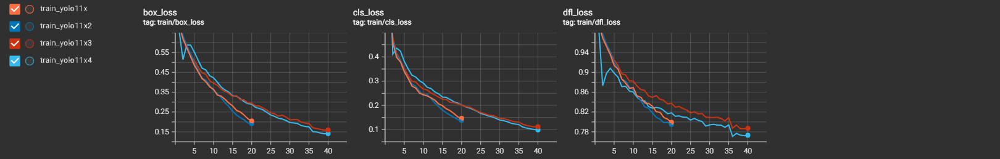
          <figcaption>Train Losses</figcaption>
      </figure>
   </div>
</div>

<div>
   <p style="text-align: left; width: 30%; font-style: italic;">Smoothing 0</p>

   <div style="display: flex; gap: 10px;">
      <figure style="text-align: center; width: 100%;">
          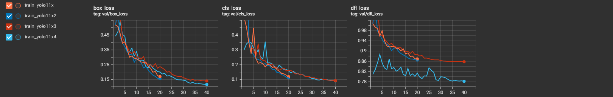
          <figcaption>Valid Losses</figcaption>
      </figure>
   </div>
</div>


- Общая тенденция: Значительная стабилизация всех типов потерь (box_loss, cls_loss, dfl_loss) на поздних эпохах.  
  
- **По метрике `train/box_loss`:**  
  - Train 1: Начальное значение **0.68857** – финальное **0.20457**.  
  - Train 2: Снижение до **0.19164** (лучше, чем в Train 1).  
  - Train 3: Достиг **0.15915** (ещё меньше).  
  - Train 4: Имеет лучшее значение: **0.14097**.  

- **По метрике `val/cls_loss`:**  
  - Train 1: Финальное значение **0.11863**.  
  - Train 2: Достигло **0.11293**.  
  - Train 3: Уменьшилось до **0.0915**.  
  - Train 4: Стабильно лучшее значение: **0.09029**.  

#### **Резюме по Loss:**  
- **Train 4** выделяется минимальными потерями на валидации и тренировке, в частности `val/cls_loss` (**0.09029**) и `val/box_loss` (**0.11628**).  

---

#### **5. Матрица ошибок (Confusion Matrix):**

<div>

   <div style="display: flex; gap: 10px;">
      <figure style="text-align: center; width: 50%;">
          
          <figcaption>Matrix Train1</figcaption>
      </figure>
        <figure style="text-align: center; width: 50%;">
          
          <figcaption>Matrix Train2</figcaption>
      </figure>
   </div>

<div style="display: flex; gap: 10px;">
      <figure style="text-align: center; width: 50%;">
          
          <figcaption>Matrix Train3</figcaption>
      </figure>
        <figure style="text-align: center; width: 50%;">
          
          <figcaption>Matrix Train4</figcaption>
      </figure>
   </div>
</div>

- **Train 1**: 3 ошибки для класса `basket`.  
- **Train 2**: 4 ошибки для класса `basket`.  
- **Train 3**: 2 ошибки для класса `basket` (улучшение).  
- **Train 4**: Только 1 ошибка для класса `basket`.  

#### **Резюме по матрице ошибок:**  
- Train 4 показывает **минимум ошибок**, подтвердив максимальную точность.  

---

## 3. **Итоговое сравнение и выводы**
Данный вывод был выполнен в ручном режиме. Ниже представлен вывод, сделанный скриптом, который выбирает лучшую модель на основе сохраненных метрик модели и показателей, полученных при валидации модели. 

**Train 4** является **наиболее успешной тренировкой**, основываясь на следующих показателях:  
1. Лучший результат по метрике `mAP50-95` (**0.99122**), что означает наибольшую точность и локализацию даже при высоких порогах IoU.  
2. Наивысшая точность (`Precision = 0.99996`) и минимальное количество ложноположительных результатов.  
3. Идеальная полнота (`Recall = 1.0`), начиная с 17-й эпохи.  
4. Минимальные валидационные потери (`val/box_loss = 0.11628`, `val/cls_loss = 0.09029`).  
5. Минимум ошибок в конфузной матрице ошибок (только 1 ошибка в классе `basket`).  

Несмотря на то, что `AdamW` в Train 1–3 показал хорошие результаты, замена оптимизатора на `SGD` (Train 4) обеспечила лучшую производительность, особенно при минимизации потерь и увеличении точности.  

### **Автоматическое сравнение модели**
Данный скрипт [compare_metrics_model.py](compare_metrics_model.py) разработан для сравнения нескольких моделей.  
Получает на вход папку проекта обучения и извлекает из неё папки тренировок и их модели (по умолчанию best).  
Извлекает метрики, проводит валидацию модели на валидационом наборе датасета.  
Определяет, какая модель набрала больше балов, опираясь на такие метрики, как:  

- metrics/mAP50-95
- metrics/mAP50
- metrics/mAP75
- metrics/precision
- metrics/recall
- metrics/F1-score
- metrics/F1-confidence

**Результат автоматического анализа** в файле [model_comparison.md](ZEBRA/compare_results/model_comparison.md)


**Рекомендации:**  
Для дальнейшего улучшения модели можно:  
- Увеличить размер и разнообразить уникальными данными набор датасета.
- Изучить набор данных, используя сервисы подобные [fiftyone](https://github.com/voxel51/fiftyone)
- При наличии большого набора данных произвести предварительное обучение, используя фреймворк [LightlyTrain](https://docs.lightly.ai/train/stable/index.html) (позволяет проводить предварительное обучение на неразмеченных данных).
- Экспериментировать с другими стратегиями аугментации данных.  
- Тестировать новые комбинации learning rate и оптимизаторов для более долгих тренировок.
- Использовать сервисы "Comet ML", "ClearML" и подобные им, для анализа метрик тренировок.

---
**Результат предсказание на видео модель Train 4**

[Видео 2_1.avi](ZEBRA/detect/predict/2_1.mp4)


---

## 4. Затраченное время:
- **Подготовка и анализ данных**: 5 часов
- **Разработка скриптов**: 7 часов 
- **Обучение нескольких моделей**: 6 часов
- **Анализ и отчетность**: 14 часов

**Общее время**: 32 часов.

---

## 5. Опыт с YOLO:
Опыт работы с Computer vision в частности и с YOLO в международном научном проекте по изучению северных морских млекопитающих для North Pacific Wildlife Consulting LLC (http://www.northpacificwildlife.com/). 
Использовались модели YOLO, Mask-Rcnn, U-Net, CenterNet (детекция, сегментация, классификация).

---

## 6. Структура проекта

## Директории

```
ZebraTest/

├── augment_data/               # Данные после аугментации
│   ├──images
│   │   └── img1.jpg
│   └── labels
│       └── img1.txt
├── balanced_data/              # Сбалансированные данные
│   ├──images
│   │   └── img1.jpg
│   └── labels
│       └── img1.txt
├── empty_imgs/                 # Пустые изображения
│       └── img1.txt
├── export_annotations_data/    # Экспортированные аннотации
│    ├── train                  # Тренировочные данные
│    │   ├── images
│    │   │   └── img1.jpg
│    │   ├── labels
│    │       └── img1.txt        
│    ├── classes.txt             # Список классов
│    └── dataset.yaml            # Конфигурация датасета
├── raw_data/                    # Исходные данные
├── split_dataset/               # Разделенный датасет
│    ├── dataset.yaml
│    ├── train
│    │   ├── images
│    │   │   └── img1.jpg
│    │   └── labels
│    │       └── img1.txt
│    ├── val
│    │   ├── images
│    │   │   └── img1.jpg
│    │   └── labels
│    │       └── img1.txt
│    └── test
│        ├── images
│        │   └── img1.jpg
│        └── labels
│            └── img1.txt
├── output_extract_frames/      
│    ├──img1.jpg                # Кадры извлеченные из видео
│    └──img1.json               # файлы аннотаций в формате (X-AnyLabeling)
├── ZEBRA/                      # Директория тренировок модели
│   ├── detect/                 # Результаты детекции на видео
│   ├── summary_img_graph/      # Графики и визуализации
│   ├── train_yolo11x/          # Результаты обучения модели 1
│   ├── train_yolo11x2/         # Результаты обучения модели 2
│   ├── train_yolo11x3/         # Результаты обучения модели 3
│   ├── train_yolo11x4/         # Результаты обучения модели 4
│   └── compare_results/        # Результаты автоматического сравнени метрик моделей
└
```

## Основные файлы

```
ZebraTest/
├── augment_dataset.py          # Скрипт для аугментации данных
├── balance_classes.py          # Скрипт для балансировки классов
├── convert_ann.py              # Скрипт конвертации .json аннотаций в yolo фармат
├── extract_frames.py           # Извлечение кадров из видео
├── prediction_by_video.py      # Предсказание по видео
├── README.md                   # Документация проекта
├── requirements.txt            # Зависимости проекта
├── split_dataset.py            # Разделение датасета
├── REPORT.md                   # Отчет о выполнении задания
├── train.py                    # Скрипт для обучения модели
├── utils.py                    # Вспомогательные функции
├── valid_model_metrics.py      # Валидация метрик модели
├── visualize_annotations.py    # Визуализация аннотаций
└── compare_metrics_model.py    # Автоматический анализ/сравнение метрик нескольких моделей
```
