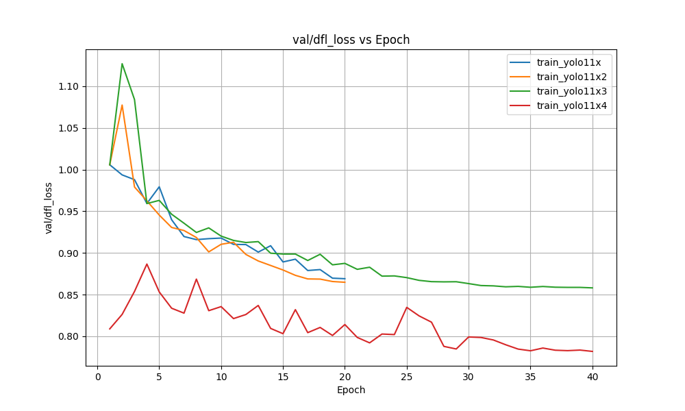

# Отчет о сравнении моделей обучения YOLO

## Лучшая обученная модель: train_yolo11x3

## Детали тренировок

| Training | Model | Date |
|----------|-------|------|
| train_yolo11x | D:\Projects\ZebraTest\ZEBRA\train_yolo11x\weights\best.pt | 2025-06-25T17:56:02.112643 |
| train_yolo11x2 | D:\Projects\ZebraTest\ZEBRA\train_yolo11x2\weights\best.pt | 2025-06-25T20:59:06.236091 |
| train_yolo11x3 | D:\Projects\ZebraTest\ZEBRA\train_yolo11x3\weights\best.pt | 2025-06-26T12:52:19.184597 |
| train_yolo11x4 | D:\Projects\ZebraTest\ZEBRA\train_yolo11x4\weights\best.pt | 2025-06-26T18:33:04.948821 |

## Сравнение показателей

### Box Detection Metrics

| Metric | train_yolo11x | train_yolo11x2 | train_yolo11x3 | train_yolo11x4 | Best Training |
|--------|------|------|------|------|-------------|
| Box mAP50-95 | 0.980315 | 0.983312 | 0.985469 | 0.991319 | ['train_yolo11x4'] |
| Box mAP50 | 0.995 | 0.995 | 0.995 | 0.995 | ['train_yolo11x', 'train_yolo11x2', 'train_yolo11x3', 'train_yolo11x4'] |
| Box mAP75 | 0.994780 | 0.994911 | 0.994941 | 0.994977 | ['train_yolo11x4'] |
| Box Precision | 0.997094 | 0.998813 | 0.999600 | 0.998777 | ['train_yolo11x3'] |
| Box Recall | 1.0 | 1.0 | 1.0 | 0.999997 | ['train_yolo11x', 'train_yolo11x2', 'train_yolo11x3'] |
| Box F1 Confidence | 0.799132 | 0.544544 | 0.887887 | 0.850517 | ['train_yolo11x3'] |
| Box F1 Score | 0.998903 | 0.999632 | 0.999999 | 0.999633 | ['train_yolo11x3'] |

## Графики 

### Training Metrics

#### time

### Training Loss

#### train box loss

#### train cls loss

#### train dfl loss

### Validation Loss

#### val box loss

#### val cls loss

#### val dfl loss

### Box Metrics

#### metrics mAP50(B)

.png)

#### metrics mAP50 95(B)

.png)

#### metrics precision(B)

.png)

#### metrics recall(B)

.png)

#### box mean f1 confidence

#### box mean f1 score

### Box Detection Metrics

#### Box mAP75

## Вывод

Анализ показателей модели: **train_yolo11x3** показала наилучшие результаты. Сравнение проводилось на основе следующих показателей: mAP50-95(B), mAP50(B), mAP75(B), precision(B), recall(B), F1-score(B), F1-confidence(B). В этом сравнении учитывались только показатели обнаружения рамок, поскольку ни у одной из моделей не было показателей сегментации масок.

### Основные преимущества:

- **Box Precision**: 0.999600 (vs 0.998813 in train_yolo11x2, 0.08% выше)
- **Box F1 Score**: 0.999999 (vs 0.999633 in train_yolo11x4, 0.04% выше)
- **Box F1 Confidence**: 0.887887 (vs 0.850517 in train_yolo11x4, 4.39% выше)

